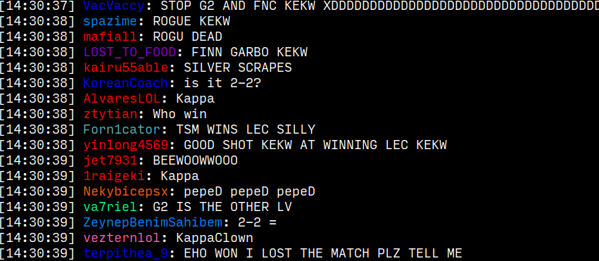
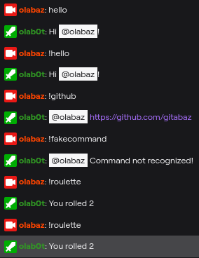

# olab0t

A twitch chat reader and bot written in pure C with no dependencies. Currently
only supports Linux due to the way sockets have been implemented.

## Features

- Join up to 10 channels simultaneously

- Bot automatically responds to basic commands

  
